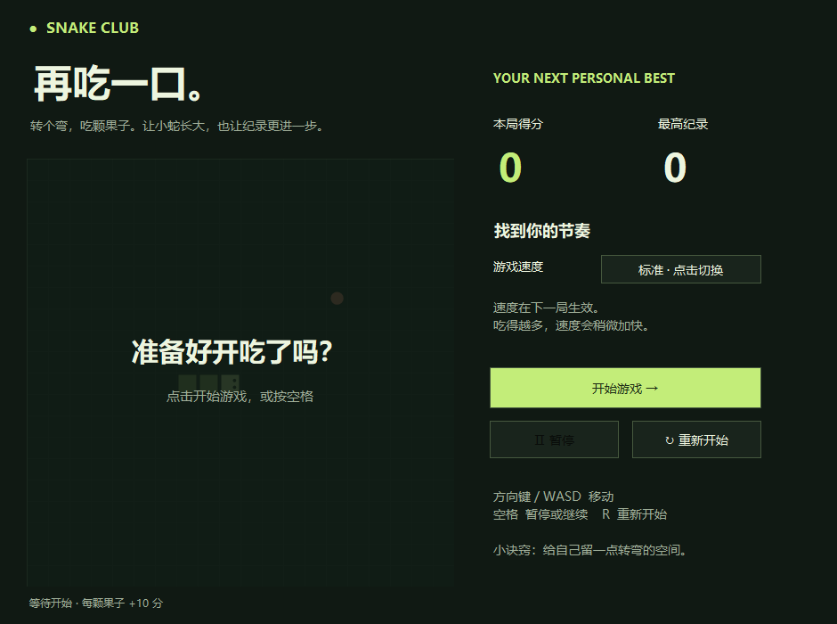

# 贪吃蛇 · Snake Club

一个可以离线玩的贪吃蛇小游戏，包含网页版和 Windows 桌面版。

## 下载 Windows 软件

**[下载 Windows 压缩包](https://github.com/chendawen-zuel/snack/raw/refs/heads/main/dist/SnakeClub-Windows.zip)**

下载后解压，双击 `SnakeClub.exe` 即可开始，无需安装。
也可以[单独下载可执行文件](https://github.com/chendawen-zuel/snack/raw/refs/heads/main/dist/SnakeClub.exe)。

适用于启用 .NET Framework 4.x 的 Windows 10 / 11。程序为本地制作的未签名软件。



## 怎么玩

| 操作 | 按键 |
| --- | --- |
| 移动 | 方向键或 WASD |
| 开始、暂停、继续 | 空格 |
| 重新开始 | R |

- 吃一颗果子得 10 分，撞到墙壁或自己的身体则结束。
- 悠闲、标准、挑战三档速度，修改后在下一局生效。
- 随着分数增长，游戏速度会略微加快。
- 窗口失去焦点时自动暂停。
- 自动记录最高分。

Windows 版最高分保存于 `%LOCALAPPDATA%\SnakeClub\best.txt`。
删除程序文件即可卸载；删除上述记录文件可清除最高分。

## 网页版

下载仓库后，用现代浏览器打开 `index.html` 即可玩。
网页版还支持手机方向按钮和滑动操作，最高分保存在浏览器中。

## 从源码构建

Windows 版源码位于 `SnakeClub.cs`，使用 C# 和 Windows Forms，构建无需下载第三方依赖。
在已安装 .NET Framework 编译器的 64 位 Windows 上，用 PowerShell 运行：

```powershell
.\build.ps1
```

构建会在 `dist` 文件夹生成程序、说明和压缩包。

游戏核心逻辑检查可通过 `SnakeClub.exe --self-test` 运行，退出码为 `0` 表示通过。

## 文件说明

| 文件 | 用途 |
| --- | --- |
| `index.html` | 独立网页版 |
| `SnakeClub.cs` | Windows 桌面版源码 |
| `build.ps1` | 构建及打包脚本 |
| `dist/SnakeClub.exe` | Windows 可执行程序 |
| `dist/SnakeClub-Windows.zip` | 可分享的软件下载包 |
| `README.txt` | 软件包内的中文使用说明 |
